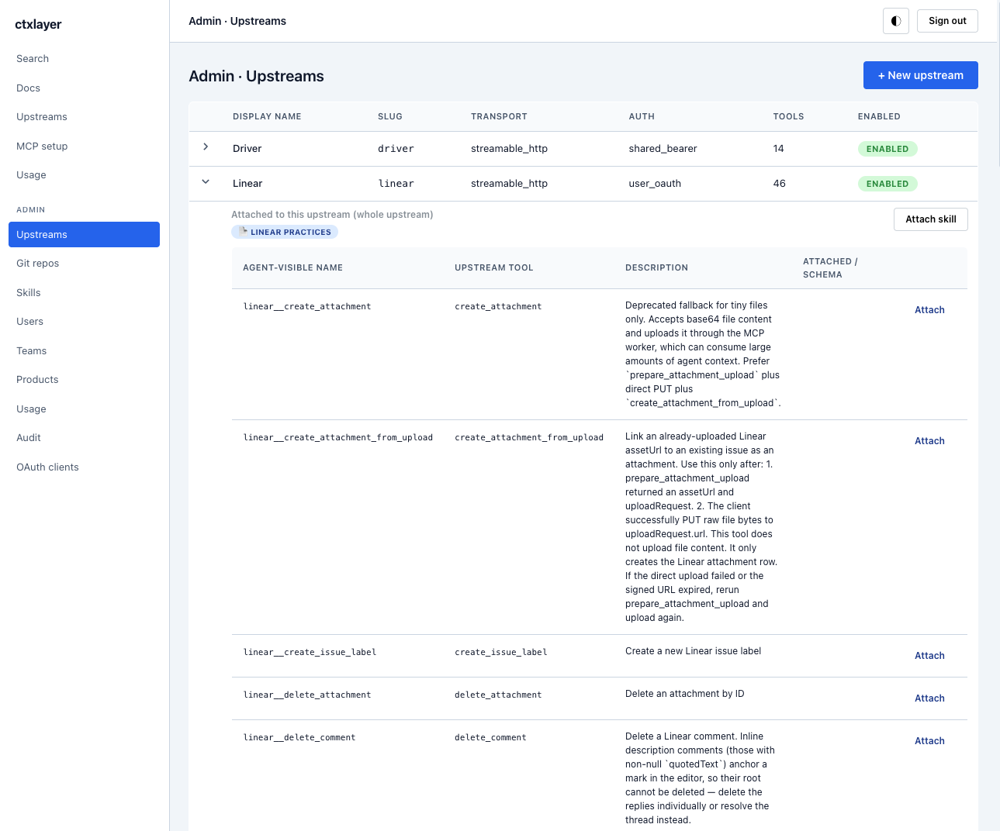
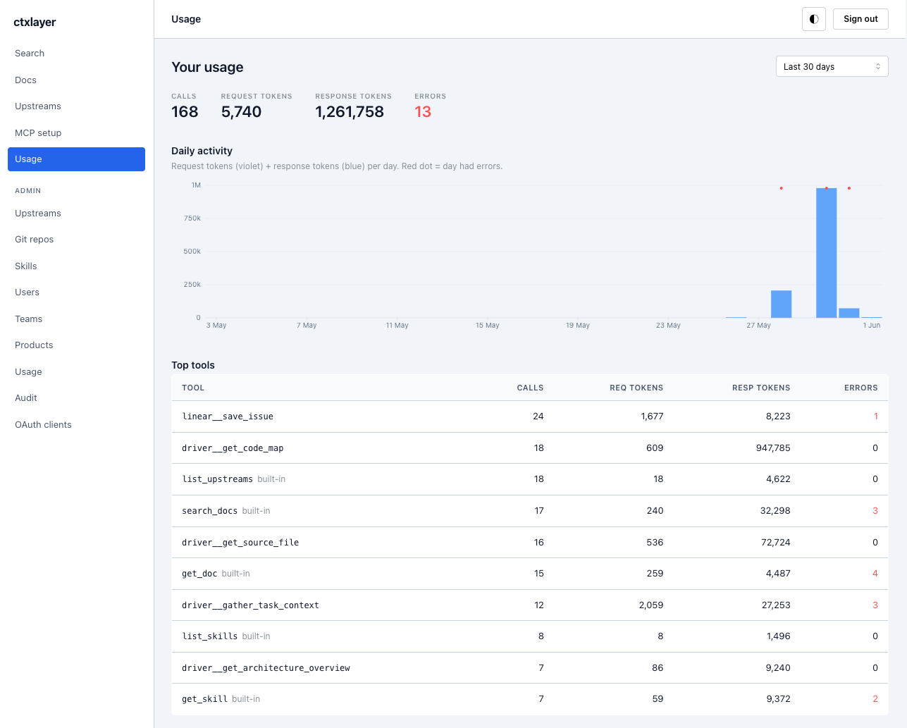
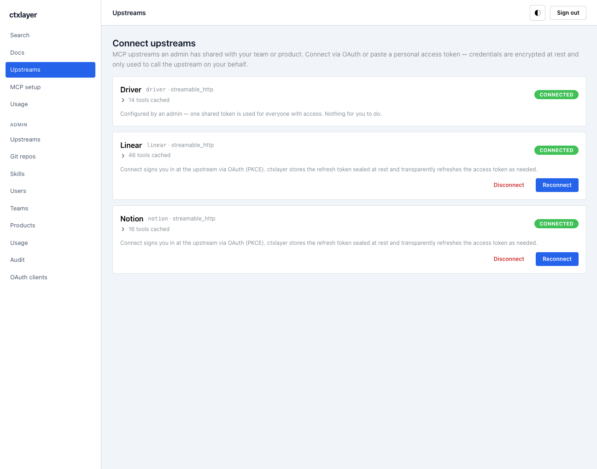
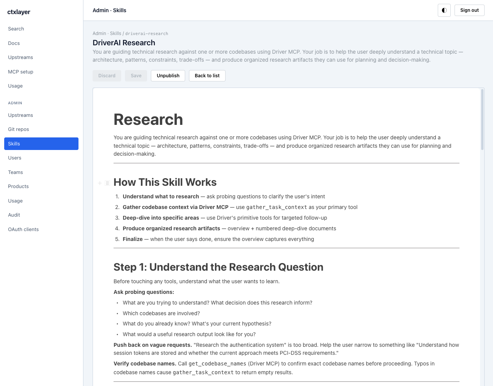
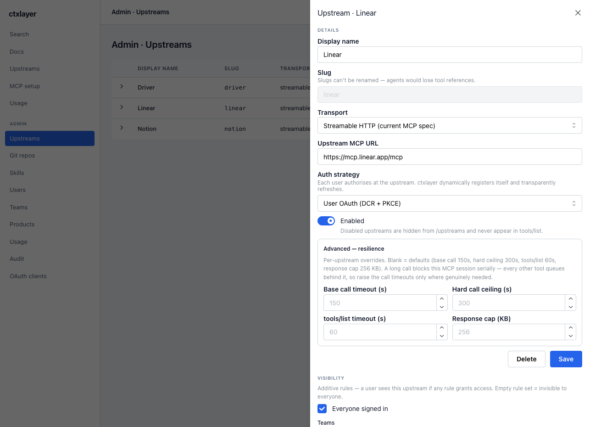

# ctxlayer

[](LICENSE)


Agent context layer — an MCP service on Cloudflare that:

- serves curated org docs (Markdown, with Vectorize-backed RAG search) as MCP
  resources and a `search_docs` tool;
- proxies other MCP servers (HTTP/SSE natively; a stdio MCP server is
  supported via bring-your-own-bridge — run your own stdio↔HTTP bridge and
  register its URL as a `streamable_http` upstream), centralising per-user
  credentials sealed at rest;
- exposes a React + Vite SPA for self-onboarding, BlockNote + Yjs
  collaborative markdown editing, admin upstream management, and usage
  analytics.

## Screenshots

|  |  |
| --- | --- |
| [](docs/screenshots/admin-upstreams.png) | [](docs/screenshots/usage.png) |
| **Curate & gate upstream MCP servers** — cache their tools, attach org playbooks + docs per tool | **Usage analytics** — calls, tokens, and top tools per user / upstream |
| [](docs/screenshots/connect-upstreams.png) | [](docs/screenshots/skills.png) |
| **Self-service onboarding** — connect upstreams via OAuth or a personal token, sealed at rest | **Curated skills** — procedural playbooks agents load on demand |

<p align="center">
  <br>
  <em>Per-upstream config — transport, auth strategy, resilience caps, and team/product visibility</em>
</p>

New here? **[`CONTRIBUTING.md`](CONTRIBUTING.md)** is the human-contributor
on-ramp (setup, the change loop, conventions); the
[Quickstart](#quickstart-contributors-hacking-on-ctxlayer) below is the
copy-pasteable version. The architecture & data-model reference is
**[`docs/PLAN.md`](docs/PLAN.md)** (the milestone-driven plan that built
ctxlayer is retired; PLAN.md is now a reference, not a roadmap). Briefing for
AI agents working in this repo is **[`CLAUDE.md`](CLAUDE.md)** /
**[`AGENTS.md`](AGENTS.md)**. Architectural conventions and gotchas live in
`docs/plan/G-conventions.md`.

> **Integration surfaces.** The supported, stable contract for external
> clients is the **MCP** surface (`/mcp`, `/sse`) plus the OAuth provider.
> The `/api/*` REST endpoints are an **internal contract for the bundled
> SPA** — not versioned and subject to change between releases. Build agents
> and scripts against MCP, not `/api`.

## Current state

Everything described in [`docs/PLAN.md`](docs/PLAN.md) is shipped and deployed.
The milestone framing below is kept as a feature inventory, not a roadmap (the
milestone-driven plan is retired — see `CLAUDE.md`).

| Area | Status | What works |
|---|---|---|
| **M1** — Skeleton + sign-in | ✅ done | GitHub / Google sign-in with allowlist, real `/api/me` |
| **M2** — Docs + RAG via MCP | ✅ done | BlockNote editor with revisions, R2 snapshots, Vectorize embedding pipeline, MCP server at `/mcp` with `search_docs` / `get_doc` / `whoami` / `list_my_context` / `list_upstreams`, doc resources, admin teams + products + tags |
| **M3** — Realtime collab (Yjs) | ✅ done | `DocRoomDO` over WS Hibernation, BlockNote Yjs extension, awareness-leader REST autosave, R2-backed snapshots |
| **M4** — Upstream proxy (HTTP/SSE + OAuth) | ✅ done | AES-GCM creds, MCP SDK Client for Streamable HTTP / SSE, namespaced tool aggregation, JSON-Schema → Zod schema preservation, full admin UI for upstreams, user `/upstreams` page with paste-bearer + OAuth. **Validated end-to-end against Notion MCP via Claude Desktop** — search, fetch, create-page. |
| **M5** — Admin polish | ✅ done | Admin Users (promote/demote + revoke creds), `shared_bearer` storage, admin Audit log viewer (`/app/admin/audit`), admin OAuth-clients viewer (`/app/admin/oauth-clients`), real `/app/mcp-setup` with per-client snippets. Bundled side features: folder organisation for docs, per-doc lock, modal-dialog system, doc-move UI |
| **M6** — Usage pipeline + dashboards | ✅ done | Per-user/upstream call + token charts, tiktoken consumer, daily rollups, admin + user usage pages |
| **Skills** — curated playbooks | ✅ done | Published skills surface over MCP (`list_skills` / `get_skill` + `mcp://ctxlayer/skills/{slug}`), per-upstream/per-tool attachments, admin skill editor, CLI `draft-skill` |
| **Git sync** — code docs from repos | ✅ done | Register a GitHub repo (PAT or OAuth), mirror Markdown into the doc store, product-link auto-tagging, scheduled cron sync |
| **Stdio upstreams** — bring-your-own-bridge | ✅ supported | Run your own stdio↔HTTP bridge; register its URL as a `streamable_http` upstream |

## Quickstart (contributors hacking on ctxlayer)

These steps are for **local development of this codebase**. End users of a
deployed ctxlayer and operators standing it up don't need any of this; see
[Deploying ctxlayer](#deploying-ctxlayer-to-production) below.

```bash
brew install mkcert nss           # macOS contributors only; see docs/plan/G-conventions.md G11 for Linux/Windows
bun install
cp .dev.vars.example .dev.vars    # then edit it — see "Filling in .dev.vars" below
bun run migrate:local             # apply D1 migrations to the local (miniflare) DB
bun run seed:local                # load fixture teams / products / upstreams / docs
bun run dev                       # or split-terminals: dev:worker + dev:web (recommended)
bun run verify                    # typecheck + lint (Biome) + unit + integration tests (all offline)
```

#### Filling in `.dev.vars`

To sign in locally you need at least one IdP. The quickest is a **GitHub OAuth
app** (<https://github.com/settings/developers> → "New OAuth App"):

- Authorization callback URL: `https://localhost:8787/idp/github/callback`
- Put its client id/secret in `GITHUB_CLIENT_ID` / `GITHUB_CLIENT_SECRET`.
- Set `ALLOWED_GITHUB_USERS=<your-login>` — the allowlist gates who may sign in.
- Set `ADMIN_EMAILS=<your-email>` so the admin pages are reachable.
- Generate `ENCRYPTION_KEY` and `SESSION_COOKIE_SECRET` with
  `openssl rand -base64 32` each.
- `PUBLIC_BASE_URL` is already set to `https://localhost:8787` in the example.

**Local dev needs no Cloudflare account** — miniflare emulates D1, KV, R2, and
Queues offline. Workers AI and Vectorize have no local emulator, so
`search_docs` returns nothing locally (the reindex consumer soft-skips
Vectorize in dev) — that's expected; exercise RAG end-to-end against a real
deploy. `bun run verify` is fully offline; `bun run verify:full` additionally
runs the `smoke` suite, which needs a running Worker (`bun run dev:worker`) or
a preview URL.

The first dev run calls `scripts/setup-dev-tls.mjs` via the `predev` hook
and generates a locally-trusted cert in `.dev-tls/`. Both Vite and Wrangler
then serve HTTPS on localhost — required for the `__Host-` session cookie
to work in dev. The cert never leaves your machine.

### Backend + frontend in separate terminals (recommended)

When you're debugging the worker (especially OAuth, MCP, or anything where
elided stack traces would bite), run each process in its own terminal so
streams don't interleave and wrangler's interactive UI works correctly:

```bash
# Terminal 1 — worker only (wrangler on https://localhost:8787)
bun run dev:worker

# Terminal 2 — SPA only (vite on https://localhost:5173)
bun run dev:web
```

To defeat wrangler's log-elision (which folds long stack traces into
`[N lines elided]`), pipe to a file:

```bash
bun run dev:worker 2>&1 | tee worker.log
# in another pane:
tail -f worker.log | grep -E '\[oauth\]|\[catalogue\]'
```

### One-window combined runner

```bash
bun run dev                       # concurrently with worker,web prefix-coloured streams
```

Convenient for SPA-focused work; less ideal when chasing a backend bug
because the two streams share one TTY and wrangler's elision is heavier.

## Wiring Claude to a local ctxlayer

`mcp-remote` shims a remote MCP server into Claude Desktop's stdio MCP
interface and handles the OAuth dance. Because localhost uses an mkcert
root that Electron-bundled Node won't trust by default, point Node at the
mkcert CA explicitly.

```bash
mkcert -CAROOT
# /Users/<you>/Library/Application Support/mkcert
```

`~/Library/Application Support/Claude/claude_desktop_config.json`:

```jsonc
{
  "mcpServers": {
    "ctxlayer-local": {
      "command": "npx",
      "args": ["-y", "mcp-remote", "https://localhost:8787/mcp"],
      "env": {
        "NODE_EXTRA_CA_CERTS": "/Users/<you>/Library/Application Support/mkcert/rootCA.pem"
      }
    }
  }
}
```

Fully quit Claude Desktop (`⌘Q`) and relaunch. On first run mcp-remote
opens a browser tab for OAuth + GitHub sign-in; tokens persist in
`~/.mcp-auth/`.

Before connecting Claude, **connect upstreams in the browser first** at
`https://localhost:5173/upstreams` — the proxy registry only registers
proxied tools (`notion__*`, etc.) for users who have stored credentials at
session-init time.

## Deploying ctxlayer to production

If you're standing up an instance of ctxlayer for your org (no source
edits), you don't need `bun run dev` or `mkcert`. Cloudflare's edge
provides real HTTPS for the public hostname automatically.

The install has four phases: **(1)** provision Cloudflare resources,
**(2)** configure at least one identity provider, **(3)** set deployment
secrets, **(4)** deploy and pin to a custom domain. The step-by-step
sequence is in the four numbered subsections below.

### 1. Provision Cloudflare resources

```bash
wrangler login                  # or set CLOUDFLARE_API_TOKEN + CLOUDFLARE_ACCOUNT_ID
bun install
bun run bootstrap               # provisions D1, KV, R2, Vectorize, both queues
                                # and patches the IDs into wrangler.toml
bun run migrate:remote          # applies migrations 0001..N to remote D1
```

`bootstrap` is idempotent — re-runnable any time. The manual fallback
(if you're not using the script) is:

```bash
wrangler d1 create ctxlayer
wrangler kv namespace create OAUTH_KV
wrangler r2 bucket create ctxlayer-docs
wrangler vectorize create ctxlayer-docs --dimensions 768 --metric cosine
wrangler queues create ctxlayer-usage
wrangler queues create ctxlayer-reindex
wrangler queues create ctxlayer-git-sync
# then paste the printed IDs into the <TODO>-marked slots in wrangler.toml
```

### 2. Identity provider configuration

ctxlayer ships **GitHub** and **Google** sign-in. Enabling an IdP is a
two-sided contract: the OAuth app at the provider, and the matching
client-id/secret + allowlist on the worker. **At least one IdP must be
enabled** — the sign-in page hides any IdP whose `*_CLIENT_ID` secret is
unset, and the allowlist is what actually decides who can sign in.

> **Plan the hostname first.** Every IdP callback URL bakes in
> `PUBLIC_BASE_URL`. If you intend to use a custom domain (recommended
> — see §4 below), decide it now so you register callbacks against the
> real hostname once, instead of re-registering after a workers.dev
> bootstrap.

#### 2a. GitHub OAuth App

1. **GitHub → Settings → Developer settings → OAuth Apps → New OAuth App.**
   *(Org-owned apps live under the org's settings; personal apps under
   the user's. Org-owned is preferable for centralised control.)*
2. Fill in:
   - **Application name**: e.g. `ctxlayer (acme)`
   - **Homepage URL**: `https://ctxlayer.acme.com`
   - **Authorization callback URL**: `https://ctxlayer.acme.com/idp/github/callback`
   - **Enable Device Flow**: leave off.
3. Click **Register application**, then **Generate a new client secret**.
   Save the client ID and the secret — the secret is shown only once.
4. If you plan to require **org membership** (`ALLOWED_GITHUB_ORG`):
   - The worker requests scope `read:org` and calls
     `GET /user/orgs` to verify membership. Org owners may need to
     **approve third-party access** under
     *Organization → Settings → Third-party access → OAuth app policy*.
   - Org-owned OAuth apps skip that approval flow.
5. Set the client creds (secrets) and the login allowlist (a non-secret
   `[vars]` value, injected at deploy from `.prod.vars`):
   ```bash
   wrangler secret put GITHUB_CLIENT_ID
   wrangler secret put GITHUB_CLIENT_SECRET
   # ALLOWED_GITHUB_USERS is a [vars] value — do NOT `wrangler secret put` it
   # (that collides with the empty [vars] default: Cloudflare error 10053).
   # Put the logins in the gitignored .prod.vars; scripts/deploy.mjs injects
   # them at deploy time (same pattern as PUBLIC_BASE_URL):
   echo 'ALLOWED_GITHUB_USERS=alice,bob' >> .prod.vars   # comma-separated logins
   #   — or, instead of (or in addition to) ALLOWED_GITHUB_USERS —
   # ALLOWED_GITHUB_ORG is declared in wrangler.toml [vars]; edit the
   # value to your org slug ("acme-inc") and deploy. Leaving both empty
   # disables GitHub sign-in entirely.
   ```
   A user passes the allowlist when they're in `ALLOWED_GITHUB_ORG` **or**
   their login is in `ALLOWED_GITHUB_USERS`. `ALLOWED_GITHUB_USERS` is
   the cheap path (no extra API call), checked first.

#### 2b. Google Workspace / Google OAuth Client

1. **Google Cloud Console → APIs & Services → OAuth consent screen.**
   - **User type**: *Internal* for a Workspace deployment scoped to
     your domain (recommended); *External* if you'll allow personal
     Google accounts via per-email allowlist.
   - Scopes: `openid`, `email`, `profile`.
2. **Credentials → Create Credentials → OAuth Client ID.**
   - **Application type**: *Web application*
   - **Authorized JavaScript origins**: `https://ctxlayer.acme.com`
   - **Authorized redirect URIs**: `https://ctxlayer.acme.com/idp/google/callback`
3. Save the client ID and secret.
4. Set the secrets and allowlist:
   ```bash
   wrangler secret put GOOGLE_CLIENT_ID
   wrangler secret put GOOGLE_CLIENT_SECRET
   # ALLOWED_GOOGLE_HD lives in wrangler.toml [vars] — set it to your
   # Workspace hosted domain (e.g. "acme.com") so Google forces the
   # account chooser to that domain and the worker verifies the
   # `hd` claim on the returned id_token.
   # For ad-hoc allowlisting, set ALLOWED_GOOGLE_EMAILS in wrangler.toml
   # [vars] (comma-separated emails, case-insensitive) and deploy.
   ```
   A user passes when their `id_token.hd` matches `ALLOWED_GOOGLE_HD`
   **or** their email is in `ALLOWED_GOOGLE_EMAILS`. Both empty
   disables Google.

#### 2c. Allowlists live in `[vars]`; only `ADMIN_EMAILS` is a secret

All four sign-in allowlists — `ALLOWED_GOOGLE_HD`, `ALLOWED_GOOGLE_EMAILS`,
`ALLOWED_GITHUB_ORG`, and `ALLOWED_GITHUB_USERS` — are declared in
`wrangler.toml [vars]` with empty defaults. The first three aren't
sensitive, so you can edit them in `wrangler.toml` directly.
`ALLOWED_GITHUB_USERS` carries personal logins, so its committed default
stays empty and the real value is injected at deploy from the gitignored
`.prod.vars` by `scripts/deploy.mjs` — the same pattern as `PUBLIC_BASE_URL`,
so nothing personal lands in git.

`ADMIN_EMAILS` is the one binding still set via `wrangler secret put`
(admin identity, not an allowlist). Don't declare it in `[vars]`: an empty
default would block the secret with Cloudflare error 10053 (*binding name
already in use*). The same trap applies in reverse to `ALLOWED_GITHUB_USERS`
now that it's a `[vars]` key — a worker still carrying an **old**
`ALLOWED_GITHUB_USERS` secret must `wrangler secret delete` it before the
first deploy that injects the var.

### 3. Deployment secrets

Beyond the IdP credentials, the worker needs:

```bash
# 32 random bytes, base64. Used by crypto/aead.ts (AES-GCM at rest for
# every user_credentials.ciphertext + every shared_bearer token).
# Losing or rotating this invalidates every stored upstream credential.
wrangler secret put ENCRYPTION_KEY                  # openssl rand -base64 32

# 32+ random bytes, base64. Used to HMAC-sign __Host-ctx_session and
# the IdP state cookie. Rotation logs every user out.
wrangler secret put SESSION_COOKIE_SECRET           # openssl rand -base64 32

# Comma-separated emails that auto-promote to admin on first sign-in.
# Subsequent role changes happen via the admin Users page.
wrangler secret put ADMIN_EMAILS                    # e.g. "you@acme.com,ops@acme.com"
```

Optional / later:

- `SENTRY_DSN_WORKER` — error reporting (leave unset to disable).
- `CI_SMOKE_OAUTH_CLIENT_ID` / `_SECRET` — only for CI smoke runs that
  drive an inbound MCP OAuth handshake.

### 4. Custom domain (recommended over workers.dev)

The default `*.workers.dev` URL works for smoke-testing, but every
production install should pin a real domain so the OAuth callback URLs
never have to change.

**Requires**: the parent zone is on Cloudflare (i.e. you transferred
DNS for `acme.com` to Cloudflare). Workers Custom Domains and Routes
both require this — Cloudflare needs to control the zone to mint the
TLS certificate and route traffic.

Add this to `wrangler.toml`:

```toml
workers_dev = false                # disable the *.workers.dev URL once the custom domain is live

[[routes]]
pattern = "ctxlayer.acme.com"
custom_domain = true               # Cloudflare manages DNS + cert automatically
```

Then redeploy (`bun run deploy`). Cloudflare provisions an A/AAAA record
and a TLS cert on first deploy; subsequent deploys are no-ops on the
routing side.

Finalise the deployment so everything points at the real hostname:

1. Set `PUBLIC_BASE_URL=https://ctxlayer.acme.com` in your gitignored
   `.prod.vars` (copy from `.prod.vars.example`; the same file carries
   `ALLOWED_GITHUB_USERS`). `scripts/deploy.mjs` injects both at deploy
   time, so the committed `wrangler.toml` stays a generic template. Redeploy.
2. Update the **GitHub OAuth App** callback URL to
   `https://ctxlayer.acme.com/idp/github/callback`
   (GitHub OAuth apps allow only one callback URL — swap, don't add).
3. Update the **Google OAuth Client** authorized JS origins +
   redirect URIs to the new hostname.
4. Confirm:
   ```bash
   curl https://ctxlayer.acme.com/api/health             # → {"ok":true}
   curl https://ctxlayer.acme.com/.well-known/oauth-authorization-server | head
   ```
5. Wire your MCP clients to `https://ctxlayer.acme.com/mcp` (see
   `/app/mcp-setup` in the SPA for per-client config snippets).

**Routes vs. Custom Domains** — if `ctxlayer.acme.com` already has
another origin behind it (you're sharing a hostname with another
service), use a route pattern instead:

```toml
[[routes]]
pattern = "ctxlayer.acme.com/*"
zone_name = "acme.com"
```

Routes don't auto-create DNS; you'll need a CNAME/A record pointing the
subdomain at the worker beforehand. For green-field deployments
`custom_domain = true` is simpler.

### Production health checklist

After the first deploy on the real domain:

- `curl https://<domain>/api/version` returns 200.
- Sign-in works for an allowed user; an outside-domain user is
  rejected with `?error=wrong_domain` or `not_in_org`.
- The first allowlisted user in `ADMIN_EMAILS` auto-promotes; the
  admin pages under `/app/admin/*` are reachable for them and 403
  for everyone else.
- `wrangler tail` shows no `ENCRYPTION_KEY missing` or
  `SESSION_COOKIE_SECRET missing` errors on cold starts.
- Connect at least one upstream via `/app/admin/upstreams` →
  `/upstreams` (paste-bearer or OAuth) and call a proxied tool from
  Claude — confirms the AES-GCM cred path end-to-end.

### Operational notes

- **Rotating `ENCRYPTION_KEY`** invalidates every stored credential —
  users must reconnect every upstream. `key_version` on
  `user_credentials` is already in the schema for a future versioned
  rotation, but the rotation tooling is unwritten.
- **Rotating `SESSION_COOKIE_SECRET`** logs everyone out (current
  sessions HMAC-verify against the old secret and fail).
- **Adding a second admin** — promote them via
  `/app/admin/users`, then drop the bootstrap account from
  `ADMIN_EMAILS` if you no longer want auto-promotion on next sign-in.
- **Audit log** (`/app/admin/audit`) is the source of truth for role
  changes, credential revocations, doc locks, and folder ops.

### Security posture

A few rules the worker enforces that are operator-visible:

- **Upstream URLs must be `https://`.** `/app/admin/upstreams` rejects
  `http://` URLs at the form layer, except for `http://localhost`,
  `http://127.0.0.1`, and `http://[::1]` (so local dev still works).
  The Worker runtime additionally has `global_fetch_strictly_public`
  set in `wrangler.toml`, which blocks egress to RFC 1918 / link-local
  ranges at the fetch layer.
- **Proxied tool failures show `upstream_error: …` to the agent.** The
  real upstream error text is logged server-side only, since upstream
  errors can carry API keys or internal hostnames. To see the real
  message, `bun run logs` (or grep for `[upstream-proxy]` in
  `bun run logs:all`).
- **The reindex consumer acks "permanent" failures** (e.g. a broken
  BlockNote payload that fails markdown render) instead of looping
  retries forever. They show up in logs as `permanent failure;
  dropping`. Transient errors (R2 / AI / D1) still retry with the
  queue's backoff.
- **IdP allowlist failures redirect to `/sign-in` with a reason code**
  (`wrong_domain`, `not_in_org`, etc.). The reason leaks the shape of
  the configured allowlist; acceptable for the UX win of telling a
  legitimate user *why* they were rejected. If your threat model
  needs that hidden, collapse to a generic `access_denied` server-side.
- **The SPA ships hardened response headers.** A
  `Content-Security-Policy` (tight `script-src 'self'`, no inline/eval),
  plus `X-Frame-Options: DENY` / `frame-ancestors 'none'` (clickjacking)
  and `nosniff`, live in `apps/web/public/_headers` — Workers Assets
  serves the SPA shell directly, so these can't be set in worker code.
  `Strict-Transport-Security` (HSTS) is **not** committed there; it's
  injected into `dist/_headers` at deploy time by `scripts/deploy.mjs`,
  so a localhost dev build never pins HSTS for `localhost`. Tune the CSP
  in lockstep with the bundle — the file documents why each directive is
  what it is.

## Useful scripts

| Command | What it does |
|---|---|
| `bun run dev` | Vite + wrangler dev in one terminal via `concurrently` |
| `bun run dev:worker` | wrangler dev only (`https://localhost:8787`) |
| `bun run dev:web` | Vite dev only (`https://localhost:5173`) |
| `bun run build` | Web (Vite) + worker (wrangler dry-run) |
| `bun run typecheck` | TypeScript across all workspaces |
| `bun run lint` / `format` | Biome lint (read-only) / format-write across the repo |
| `bun run test` / `test:int` | Vitest unit tests / worker integration tests (miniflare D1) |
| `bun run verify` | typecheck + lint + test + test:int — the pre-PR gate, fully offline |
| `bun run verify:full` | `verify` **plus** `smoke` (needs a running Worker or preview URL) |
| `bun run smoke` | Hit `/api/health`, `/api/version`, `/api/config`, `/api/me`, `/.well-known/oauth-authorization-server`, `POST /mcp`, `/sign-in`. Pass `SMOKE_ME_OK=1` if your CI sends a session cookie. |
| `bun run bootstrap` | Provision D1 / KV / R2 / Vectorize / queues and patch IDs into `wrangler.toml` |
| `bun run migrate:local` / `migrate:remote` | Apply D1 migrations |
| `bun run seed:local` / `seed:remote` | Seed fixtures. `seed:remote` requires explicit invocation + 3s abort window |
| `bun run deploy` / `deploy:preview` | Build web + worker, deploy. Preview uses `wrangler versions upload`. |
| `bun run logs` / `logs:all` / `logs:mcp` | `wrangler tail` filters (errors / all / `/mcp` traffic) against the live deploy |

## Layout

```
apps/worker/      Cloudflare Worker — Hono routes, MCP server, OAuth provider,
                  DOs (McpSessionDO + DocRoomDO), upstream proxy, queue consumers
apps/web/         React SPA — Vite, BlockNote editor, admin pages, /upstreams
packages/shared/  Zod schemas + types shared between worker and SPA (the wire contract)
packages/cli/     The `ctxlayer` CLI — login, pull org skills into Claude Code, draft-skill
docs/             PLAN.md + topic deep-dives under docs/plan/
scripts/          Bootstrap, dev-TLS, smoke, seed, deploy
```
